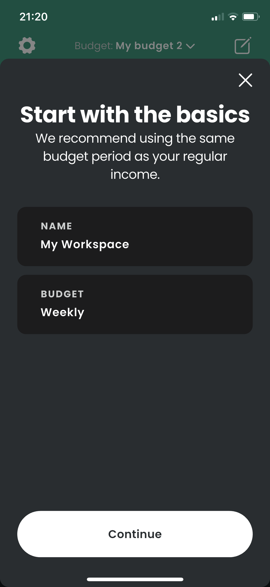
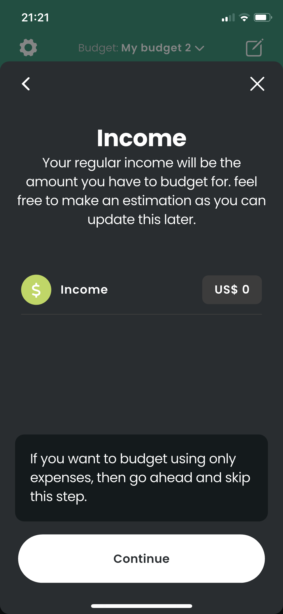
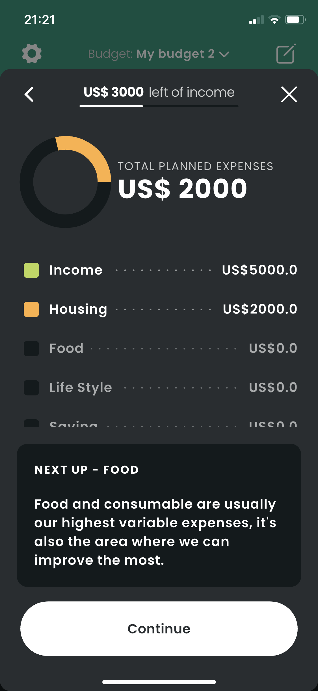
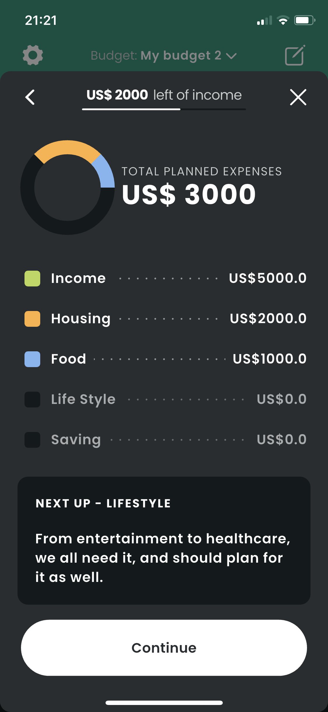
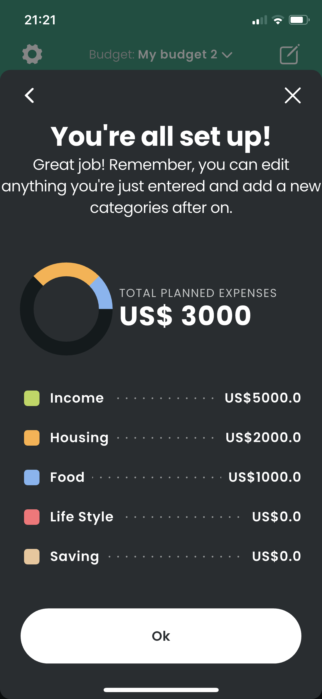

# **Budget Application (Buddy Clone)**

## **Table of Contents**

1. [About the Project](#about-the-project)
2. [Features](#features)
3. [Demo](#demo)

---

## **About the Project**

The Budget Application is inspired by the Buddy App, designed to help users efficiently manage their finances. Whether it's creating budgets, setting savings goals, or tracking expenses, this app ensures financial clarity and discipline.

This app is a **work in progress**, with more features being actively developed.

---

## **Features**

### **Current Features:**

- **Create Budgets:**
  - for a specific period **week**, **bi-week**, **month**, **bi-month** and **year**.
  - With or without an income source.
  - add **Fixed** and **Variable** expenses.

### **Upcoming Features:**

- **Goal Setting:**
  - Set and monitor financial goals (e.g., vacation savings, emergency funds).
- **Reminders:**
  - Notifications for upcoming expenses or budget deadlines.
- **Multi-Currency Support:**
  - Manage finances in different currencies.
- **User Authentication:**
  - Securely save and retrieve data with cloud-based storage.

---

## **Demo**

1. **Create Budget**:
   
   
   
   
   
   

2. **View Budget**
   
